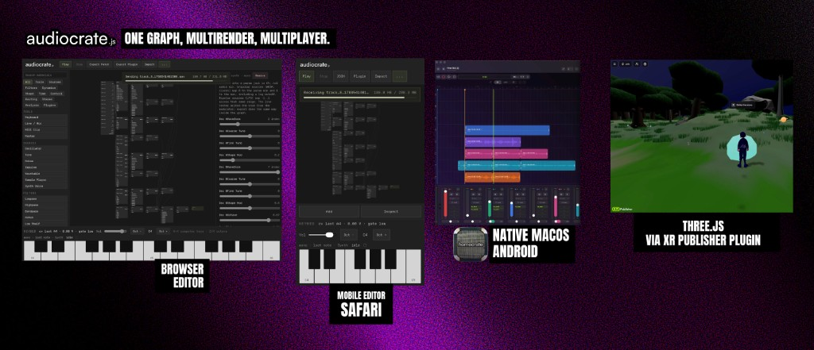

# audiocrate

A scene graph, an extensible Material system, and a serializable DSP graph
that the same interpreter runs offline and in an AudioWorklet.

Inspired by how three.js is organized: a scene of objects, materials you
can write yourself, and loaders. Not an editor. This repo also has
[`editor/`](editor/README.md), an example app that is not in the npm package.



```bash
npm install audiocrate
```

No bundler plugin. No peer dependencies.

---

## What it is

Web Audio is a graph of platform nodes (`BiquadFilterNode`, `GainNode`, and
the rest). Custom DSP means writing an `AudioWorkletProcessor`, then a
parameter system, a message protocol, and an offline path around it.

Libraries on top of that often ship an application: their sounds, their
timeline, their track model.

Audiocrate is the layer underneath that.

## Shape

| three.js | Audiocrate |
|---|---|
| `Scene` | `AudioScene` |
| `Mesh` (geometry + material) | `Clip` (buffer + Material) |
| `Material` / `ShaderMaterial` | `Material` / a Material with an ASL graph |
| `WebGLRenderer` | `WebAudioRenderer` |

The mapping is structural, not a port. `Object3D` is a transform hierarchy;
`Track` and `Bus` are mixer nodes (volume, pan, mute, inserts). Positions
live on `scene.spatial`. You do not call `renderer.render(scene)`: live
playback is on the scene, and `OfflineRenderer` takes a Material graph.

Audio also needs a transport with one scheduling origin and a tempo map.
The audio thread is an isolated context with no imports and a hard deadline,
which is why kernels and measurement work the way they do.

## Materials

```ts
import { Material, param, filter, osc, env } from 'audiocrate';

const bell = new Material({
  name: 'Bell',
  params: {
    pitch: param.range(50, 2000, { default: 440, unit: 'Hz' }),
    cutoff: param.range(200, 12000, { default: 3000, unit: 'Hz' }),
  },
  graph: ({ params }) =>
    filter.lowpass(
      osc({ freq: params.pitch, type: 'sine' })
        .mul(env.adsr({ attack: 0.005, decay: 0.4, sustain: 0, release: 0.1 }).trigger(1)),
      { cutoff: params.cutoff },
    ),
});
```

A parameter schema and a signal graph, both plain data. From that:

- **Real-time playback**, compiled into one AudioWorklet per voice, not one
  `AudioNode` per operation.
- **Offline rendering** through the same interpreter.
- **An inspector model.** `describeMaterial(bell)` returns the faders,
  ranges, and units. Audiocrate does not draw them.
- **Serialization.** The graph is JSON.

A new Material does not require a change inside this library.

## Rendering

```ts
import { OfflineRenderer } from 'audiocrate';

const { samples, sampleRate } = OfflineRenderer.render(bell.graph, {
  duration: 0.5,
  sampleRate: 48000,
  params: { pitch: 440, cutoff: 3000 },
});
```

```ts
import { WebAudioRenderer } from 'audiocrate';

const ctx = new AudioContext();
const renderer = new WebAudioRenderer(ctx);
const voice = await renderer.createVoice(bell.graph);
voice.node.connect(ctx.destination);
voice.noteOn({ pitch: 440 });
```

Same graph. Same interpreter. The offline path is not a second implementation.

## Scenes

```ts
import { AudioScene, Track, Clip, Time } from 'audiocrate';

const scene = new AudioScene();
await scene.start();

const guitar = scene.addTrack(new Track({ name: 'Guitar' }));
guitar.pan = 0.3;
guitar.materials.add(bell);
guitar.addClip(new Clip({ buffer }), { at: Time.bars(2, 1, 0) });

scene.transport.play();
```

Time is structured (`Time.bars(2, 1, 0)`). One scheduling origin, a tempo map,
and a transport that offline and live rendering share.

## Same graph, more than one place

A second interpreter exists in Swift. A conformance gate renders 83 graphs
covering all 70 node kinds through both, comparing sample by sample to a
tolerance of 5e-6. Adding a node kind to one implementation and not the other
fails the build on both sides.

## Size

Minified, bundled by esbuild from the published tarball. Run
`node scripts/measure-size.mjs` to reproduce. The imports behind each row
are in that script.

| What you import | Bundled |
|---|---|
| `audiocrate/theory` alone | 1.1 KB |
| Scene graph plus offline rendering | 73 KB |
| Everything including real-time audio | 181 KB |

The AudioWorklet is 101 KB of that last row. A worklet realm cannot import,
so it carries the whole interpreter as a string and minifying does not
shrink it. Apps that never play real-time audio tree-shake it away. That
is the difference between the second row and the third.

## The worklet and your bundler

An `AudioWorkletProcessor` runs with no imports and no network. It has to
arrive as one self-contained script fetched from a URL, and bundlers do not
agree on how to produce one.

Audiocrate ships the worklet as a string and mints URLs at runtime, trying
`blob:` then two flavours of `data:` in order. Engines disagree about which
schemes a worklet may load. There is nothing to configure and no plugin to
install.

To serve it as a cacheable asset, import `audiocrate/worklet` and pass
`workletUrl` to `WebAudioRenderer`.

## Also included

| | |
|---|---|
| **Theory** | Notes, scales, chords, key detection, pitch tracking. Standalone, no audio engine. |
| **Spatial** | Positional sources and listener maths. |
| **Collaboration** | Shared session state over a transport you supply. Audiocrate does not open a socket. |
| **Hooks** | Named extension points for a host application. |
| **Testing** | Offline render-diff harness and wav encode/decode. |

## Documentation

| | |
|---|---|
| [Philosophy](docs/philosophy.md) | Design rules and scope |
| [Scenes and time](docs/scene.md) | Scenes, tracks, clips, transport, tempo maps |
| [Materials](docs/materials.md) | Parameters, graphs, plugins, assets |
| [The Audio Shader Language](docs/asl.md) | Nodes, graphs, live inputs, channels, measurement taps |
| [Kernels](docs/kernels.md) | Block-shaped DSP, portable wasm modules |
| [Component library](docs/components.md) | Shipped Materials and nodes |
| [Theory](docs/theory.md) | Notes, scales, chords, keys, audio to notes |
| [Spatial](docs/spatial.md) | Placing sound in 3D, listener rotation, binaural decode |
| [Collaboration](docs/collab.md) | Session state, discrete edits, the shared clock, and host-local devices |
| [Hooks](docs/hooks.md) | Extending a host without forking Audiocrate |
| [Conformance](docs/conformance.md) | How cross-implementation agreement is enforced |
| [Editor](editor/README.md) | Example Material graph editor (not published) |

Full docs: **<https://homecrate.app/docs/crate/>**

## What Audiocrate is not

- **Not a DAW.** The published package has no UI.
  [`editor/`](editor/README.md) lives in this repository and is not shipped on npm.
- **Not a plugin format.** It hosts DSP. It does not replace AU, VST, or
  similar standards.
- **Not a cloud service.** Nothing here requires a server. The collaboration
  layer takes a transport you supply.
- **Not a sample library.** Core ships primitives: filters, envelopes,
  delays, the usual building blocks.

## Status

**0.1.0, first public release.** Expect breaking changes in minor versions
until 1.0.

Known limits, also listed in the docs: the conformance gate renders only
fixed parameters, mobile voice budgets are estimated rather than profiled,
and the kernel path has one shipped implementation.

## License

MIT. See [LICENSE](LICENSE).
