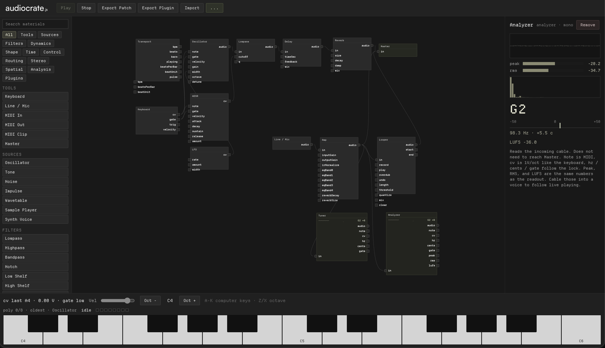

# editor

Patch graph for audiocrate AudioMaterials. Lives in this repo as an example app,
not in the npm package.

Patch nodes, play them, export a `crate.plugin`. Amp, grain, synth, and IR
plugins load when those packages sit next to this one (`../crate-amp`, and so
on). A crate-only checkout still boots.



## Run

From the audiocrate package root:

```bash
npm install
npm run editor
```

Then open http://localhost:5175

```bash
npm run test:editor
```

JS-only changes hot reload. After an AudioMaterial or worklet change,
hard-refresh the tab.

## Transport

Tempo and time signature live on the Transport node (`bpm`, `beatsPerBar`,
`beatUnit`), not on Clock or Synced Clock. New patches and imported
homecrate projects place one. Play publishes those params as the session
anchor. See [the time signature rule](../docs/asl.md#time-signature-is-two-numbers).
